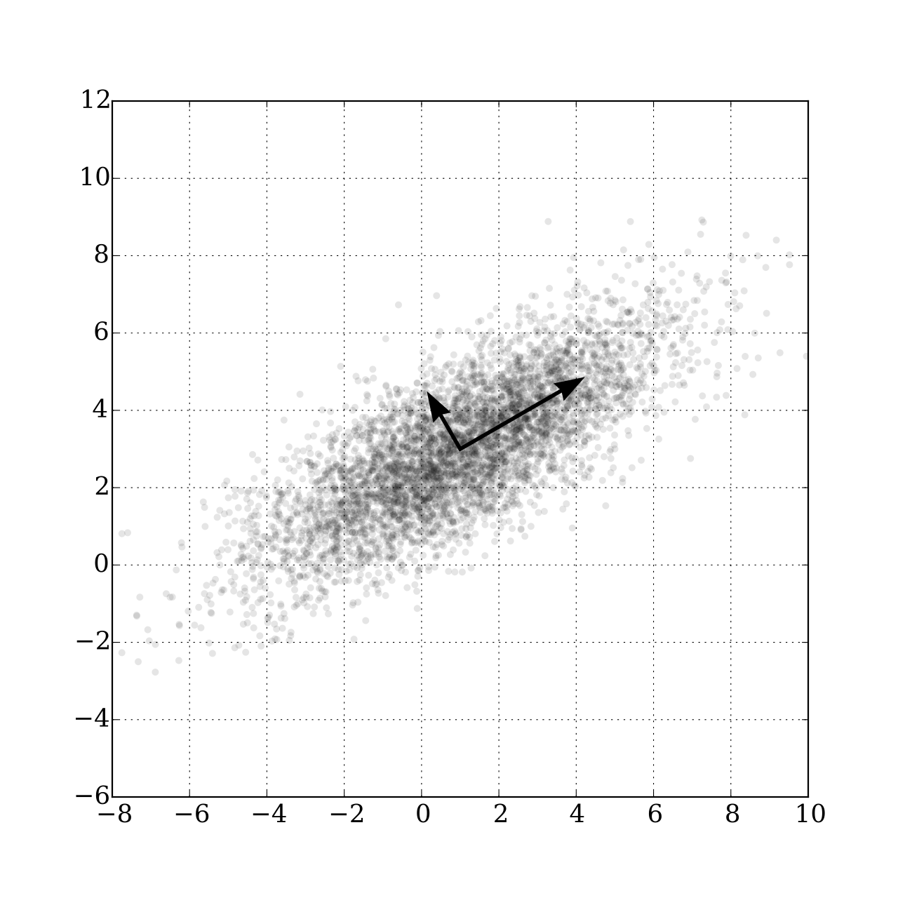

# Just Enough Data

Ready for a perspective that might change how you see data?

> [Menzies's 4th Law](../refs.html#menzies2025a): For Software Engineering (SE), the best thing
to do with most data is to throw it away.

(Now, here I'm talking about tasks like regression, classification, and
optimization. Those fancy generative AI models that write poems or
paint pictures? They do seem to gobble up billions of data points,
fair enough.)

For many common problems, if you give me a data table, I'm telling
you: chopping out rows and columns often makes your models better.
Sounds nuts, right?  But many researchers  have found that a tiny set
of ['key' variables](../refs.html#menzies2007a) calls the shots for the rest of the model. Nail
these keys, and controlling the whole shebang becomes a walk in the
park.

This isn't some new fad. These "keys" have been popping up in AI
for ages, wearing different disguises: principal components, variable
subset selection, narrows, master variables, and backdoors.

In 1895,  the Italian economist Vilfredo Pareto coined his famous
Pareto Principle when he said 80% of the effects come from 20% of
the causes.  This result pops up everywhere: e.g.  
[80% of software bugs might come from 20% of modules](../refs.html#ostrand2004), 
80% of sales from 20% of
clients., etc,

(Actually, it often feels even more extreme. I often  do not see
80:20 but more like 1000:1 since, in my experiences,  a tiny fraction
of factors dictates almost everything.)

Moving forward now to 1902, 
[Pearson](../refs.html#pearson1902) noticed that even in datasets
with many dimensions, a handful of principal components captured
the main "drift" of the data.  For example, in the data shown at
right, simply looking left-to-right or up-to-down (along the original
axes) might not capture the overall direction or main variation in
the data.  Instead, Pearson's PCA (principal component analysis)
finds a new, synthesized dimension. This single synthesized dimension
(see the big arrow, at right) is often the best way to model the
data's primary structure

Pearson's math for PCA might make your eyes glaze over, but the
core idea is pretty simple.  If you want to see the "direction" of
your data rows:

- Figure out a way to measure the distance between rows[^1].  
- Draw a line between two rows that are super far apart, let's call
  them A and B.  
- Draw a second line at a right angle to that first
  one.  
- Plot every other data point based on where it lands relative
  to these two lines[^2].

[^1]: According to instance-based
reasoning guru [David Aha](../refs.html#aha1991), the distance between two points A,B
is \\(\sum_i(D(A_i,B_i)^2)^{0.5}\\)
 (calculated over all the independent x columns). For symbolic
 columns, \\(D(x,y) = x!=y\\).
For numerics, \\(D(x,y)=abs(x′−y′)\\)
 where _x'_ is x normalized 0..1 min..max. For missing values,
 assume maximum distances. For example, if _x,y_ are both missing,
 then D=1. If one is missing then we make the assumption that
 maximizes the distance; e.g.: _x=x if x!="?" else (1 if y<0.5 else
 0)_

[^2]: Let _A,B_ be 
two distance points, separated by distance _c_. Let a point P have
a distance _a,b_ to the points _A,B_.  The cosine rule says _P_ has
an _x_ position \\(x=\frac{a^2 + c^c - b^2}{2c}\\) and Pythagoras
says _P_ has a _y_ position of \\(y=(a^2-x^2)^{0.5}\\).

Check out this analysis on a spreadsheet with 20 columns and 800
rows describing software classes (think "lines of code," "number
of unique symbols," etc.). The red dots are code with known bugs.

Now imagine yourself trying to understand the raw data (800 rows,
20 numbers). All you might see is a  jumbled mess.  But after this
trick, everything lines up like soldiers on parade, with the bad-boy
defective codes clearly visible on the right.

The here lesson is  clear: problems, and the data they spit out,
often have a simpler, hidden structure. And you can use this
simplicity to your advantage.

For instance:

- [Amarel's Narrows](../refs.html#amarel1960s) (1960s): Back in the '60s, Amarel spotted "narrows"
in search problems – tiny sets of essential variable settings. Miss
these, and you're lost [11]. His trick? Create "macros" to jump
between these narrows, like secret passages in a maze, speeding up
the search big time.

- [Kohavi & John](../refs.html#kohavi1997) 's Variable Pruning (1990s): Fast forward to the
'90s, Kohavi and John showed you could chuck out up to 80% of
variables in some datasets and still get great classification
accuracy [13]. Sound familiar? It's Amarel's idea again: focus on
the VIP variables, not the whole crowd.

- [Crawford & Baker](../refs.html#crawford1994)'s ISAMP (1990s): Around the same time, constraint
satisfaction folks found that "random search with retries" was
surprisingly effective. Crawford and Baker's ISAMP tool would
randomly poke around a model until it hit a dead end [12]. Instead
of fussing, ISAMP would just note where it got stuck, hit reset,
and try a different random path. Why did this wacky method work?
They figured models have a few "master variables" (our keys!) pulling
the strings. Trying to check every setting is a waste of time if
only a few matter. If you're stuck, don't tiptoe – jump to a whole
new area.

- [Williams et al.](../refs.html#williams2002)'s Backdoors: Williams and his colleagues found
that if you run a random search enough times, the same few variable
settings pop up in all good solutions [10]. Set these magic variables
first, and crazy-long searches suddenly became quick and easy. They
called this the "backdoor" to reducing computational complexity.
Pretty tricky, right?

- Modern Feature Selection: Today's machine learning is built on
this. Techniques like LASSO regression (which shrinks less important
variable coefficients, sometimes to zero) or using feature importance
scores from decision trees are all about finding and focusing on
those powerhouse variables.

- [Knowledge Distillation](../refs.html#zeming2024): Another cool, modern take on this is
knowledge distillation. Here, a large, complex 'teacher' model
(trained on tons of data) transfers its 'knowledge' to a much
smaller, simpler 'student' model. The student model learns to mimic
the teacher's outputs, effectively capturing the essential insights
without all the bulk. It's like getting the CliffNotes version of
a massive textbook, but it still aces the test.

Other work  in [semi-supervised learning](../refs.html#van-engelen2020)
tells us that 
: you don't
need to obsess over all your data. Semi-supervised
learners rely on a few central
ideas:

- **Continuity/Smoothness Assumption**: Points close together probably
share the same label. No big jumps in meaning for tiny data shifts.
- **Cluster Assumption**: Data likes to hang out in clumps. Points in
the same clump likely share a label. Decision boundaries should
fall in the sparse areas between clumps.  
- **Manifold Assumption**:
Your high-dimensional data often chills out on a simpler,
lower-dimensional surface (the "manifold").  These assumptions
basically mean your data isn't a completely random mess; it has
structure.

There's also maths to back up these assumptions.
The
[Johnson-Lindenstrauss](../refs.html#johnson1984) lemma  which says you can project high-D
data to lower-D space while mostly preserving distances.
We do not have to go into the details of that result but, long story short, it is telling
us that complex data can often be approximated by a much simpler data set.
For instance, 
[Kocaguneli](../refs.html#kocaguneli2013), 
[Tu](../refs.html#tu2022), 
[Peters](../refs.html#peters2015), and 
[Xu et al.](../refs.html#xu2021) found
they could predict GitHub issue close times, effort, and defects
even after ditching labels for a whopping 80%, 91%, 97%, 98%, and
even 100% (respectively) of their project data.
Massive datasets with thousands of rows? Sometimes, just a few dozen
samples will [do the trick](../refs.html#menzies2008) – maybe because software project
data is [full of repeating patterns](../refs.html#hindle2012) or follows 
[power laws](../refs.html#lin2015)
(where a few items are hugely frequent/important, and most are
rare).

So, next time you're drowning in data, remember the Great Data
Toss-Away. Less can seriously be more.
